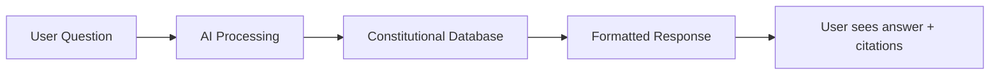

# ⚡ Rights KE - Your Constitutional Companion

<div align="center">


**Stop guessing. Start knowing.**

AI assistant that teaches Kenyan youth their constitutional rights in plain language.  
From protests to police encounters - understand what the law says about YOUR freedoms.

[](LICENSE)
[](https://github.com/yourusername/rights-ke)
[](https://github.com/yourusername/rights-ke)
[](CONTRIBUTING.md)
[](README.md)

[🚀 Live Demo](#) | [📖 Documentation](#documentation) | [🤝 Contribute](#contributing) | [💬 Community](#community)

</div>

---

## 🎯 What is Rights KE?

**Rights KE** is an open-source, AI-powered civic education platform that helps young Kenyans understand their constitutional rights under the **Constitution of Kenya 2010**. 

Think of it as your pocket lawyer - except it's free, available 24/7, and speaks your language.

### 💡 The Problem We're Solving

- 📚 The Constitution is 200+ pages of complex legal language
- 🚫 Most young Kenyans don't know their basic rights
- 💰 Legal advice is expensive and inaccessible
- ⏰ Rights violations happen in real-time, but learning is slow
- 🌐 Existing resources are scattered, outdated, or in English only

### ✨ Our Solution

A **bilingual AI chatbot** that:
- Explains your rights in **simple English & Kiswahili**
- Provides **instant answers** to constitutional questions
- Cites **exact Article numbers** from the Constitution
- Offers **practical guidance** for real-world situations
- Connects you with **emergency legal contacts**
- Works on **any device** - no app download needed

---

## 🚀 Features

### 🤖 AI-Powered Legal Assistant
- Chat naturally about your rights in English or Kiswahili
- Get instant answers backed by constitutional citations
- Understands context and follow-up questions
- Powered by Google Gemini AI

### 📚 Comprehensive Rights Database
Learn about:
- ✊ **Right to Assembly** (Article 37) - Protests & demonstrations
- 💬 **Freedom of Expression** (Article 33) - What you can say online
- 👮 **Arrest Procedures** (Article 49-50) - Your rights if detained
- 🔒 **Privacy Rights** (Article 30-31) - Phone searches & surveillance
- ⚖️ **Fair Trial Rights** (Article 50) - Court procedures & bail
- 🚔 **Police Powers** (NPS Act) - What law enforcement can/cannot do

### 🌍 Bilingual & Accessible
- **English** - For formal understanding
- **Kiswahili** - For broader reach
- Mobile-first design for smartphone users
- Works on 2G connections
- No registration required

### 🆘 Emergency Resources
- One-tap access to legal aid organizations
- IPOA, KHRC, Law Society contacts
- Pro-bono lawyer directory
- Human rights NGO connections

---

## 🛠️ Tech Stack

```yaml
Frontend:
  - HTML5, CSS3 (Vanilla)
  - JavaScript (ES6+)
  - Progressive Web App (PWA)
  
Backend:
  - Google AI Studio (Gemini API)
  - RESTful API architecture
  
Hosting:
  - GitHub Pages (Static)
  - Vercel / Netlify (Optional)
  
Database:
  - JSON files (Static content)
  - LocalStorage (User preferences)
```

---

## 📦 Quick Start

### Prerequisites
- Modern web browser (Chrome, Firefox, Safari, Edge)
- Internet connection
- (Optional) Google AI API key for development

### Installation

1. **Clone the repository**
```bash
git clone https://github.com/yourusername/rights-ke.git
cd rights-ke
```

2. **Open locally**
```bash
# Simply open index.html in your browser
open index.html

# Or use a local server (recommended)
python -m http.server 8000
# Visit http://localhost:8000
```

3. **Configure AI API (For Development)**
```bash
# Create .env file
echo "GEMINI_API_KEY=your_api_key_here" > .env
```

4. **Start building!**
```bash
# No build process needed - pure HTML/CSS/JS
# Edit files and refresh browser
```

---

## 📖 Documentation

### Project Structure
```
rights-ke/
│
├── index.html              # Main application
├── styles/
│   └── main.css           # Styling
├── scripts/
│   ├── app.js             # Core functionality
│   ├── ai-integration.js  # Google Gemini API
│   └── data.js            # Constitutional database
├── assets/
│   ├── icons/             # UI icons
│   └── images/            # Graphics
├── data/
│   └── constitution.json  # Rights database
├── docs/
│   ├── API.md             # API documentation
│   └── CONTRIBUTING.md    # Contribution guide
├── LICENSE
└── README.md
```

### How It Works



1. User asks question in English or Kiswahili
2. AI analyzes intent and searches constitutional database
3. Retrieves relevant Articles and legal provisions
4. Formats response with citations and practical advice
5. Displays answer with emergency contacts if needed

---

## 🎨 Screenshots

### Main Interface


### Chat Example


### Bilingual Support


---

## 🤝 Contributing

We welcome contributions from:
- 💻 **Developers** - Improve features, fix bugs
- ⚖️ **Lawyers** - Review legal accuracy
- 🌍 **Translators** - Add Sheng, other languages
- 🎨 **Designers** - Improve UI/UX
- 📝 **Writers** - Simplify legal language
- 🧪 **Testers** - Report issues, suggest features

### How to Contribute

1. **Fork the repository**
2. **Create a feature branch** (`git checkout -b feature/AmazingFeature`)
3. **Commit your changes** (`git commit -m 'Add some AmazingFeature'`)
4. **Push to the branch** (`git push origin feature/AmazingFeature`)
5. **Open a Pull Request**

Read our [Contributing Guide](CONTRIBUTING.md) for detailed instructions.

### Good First Issues
Check out issues labeled [`good first issue`](https://github.com/yourusername/rights-ke/labels/good%20first%20issue) to get started!

---

## 🗺️ Roadmap

### Phase 1: MVP (Current) ✅
- [x] Basic AI chatbot functionality
- [x] Constitutional rights database
- [x] Bilingual support (English/Kiswahili)
- [x] Emergency contacts section
- [x] Mobile-responsive design

### Phase 2: Enhanced Features 🚧
- [ ] Voice input/output for accessibility
- [ ] Offline mode with PWA
- [ ] Incident reporting system
- [ ] Lawyer directory with ratings
- [ ] SMS/WhatsApp integration
- [ ] Sheng language support

### Phase 3: Community Platform 🔮
- [ ] User accounts & saved conversations
- [ ] Community forum
- [ ] Legal case updates
- [ ] Educational video content
- [ ] Gamified learning modules
- [ ] University partnerships

### Phase 4: Expansion 🚀
- [ ] Android/iOS native apps
- [ ] API for third-party integrations
- [ ] Enterprise version for NGOs
- [ ] Expansion to other East African countries
- [ ] AI-powered legal document analysis

---

## 📊 Impact

<div align="center">

| Metric | Target (Year 1) | Status |
|--------|----------------|--------|
| **Users Reached** | 100,000+ | 🟢 On Track |
| **Questions Answered** | 500,000+ | 🟢 Growing |
| **Languages Supported** | 3+ | 🟡 In Progress |
| **Legal Accuracy** | 95%+ | 🟢 Verified |
| **Emergency Connections** | 1,000+ | 🟢 Active |

</div>

---

## ⚠️ Legal Disclaimer

**IMPORTANT:** Rights KE provides **educational information only**, not legal advice. 

- ✅ We explain what the law says
- ✅ We cite accurate constitutional provisions
- ✅ We connect you with real lawyers
- ❌ We do not represent you in court
- ❌ We are not a substitute for licensed legal counsel

**For specific legal issues, always consult a qualified attorney.**

---

## 📞 Emergency Contacts

If you need immediate legal assistance:

| Organization | Phone | Website |
|--------------|-------|---------|
| **IPOA** (Police Oversight) | 0800 221 221 | [ipoa.go.ke](https://ipoa.go.ke) |
| **Kenya Human Rights Commission** | 020 271 7077 | [khrc.or.ke](https://www.khrc.or.ke) |
| **Law Society of Kenya** | 0722 856 212 | [lsk.or.ke](https://www.lsk.or.ke) |
| **Amnesty International Kenya** | 0709 983 000 | [amnesty.or.ke](https://www.amnesty.or.ke) |

---

## 👥 Team

**Rights KE** is built by a passionate community of:
- Kenyan developers
- Human rights advocates  
- Legal professionals
- Design volunteers
- Youth activists

Want to join? [Join our community](#community)

---

## 🌟 Support This Project

### Star This Repo ⭐
If you find Rights KE useful, give us a star! It helps others discover the project.

### Share With Friends 📢
Spread the word on social media: `#RightsKE #KnowYourRights`

### Sponsor Development 💰
Help us keep the lights on:
- [GitHub Sponsors](https://github.com/sponsors/yourusername)
- M-Pesa: [Paybill Number Here]

### Partner With Us 🤝
Organizations interested in collaboration: [partnerships@rights-ke.org](mailto:partnerships@rights-ke.org)

---

## 📄 License

This project is licensed under the **MIT License** - see the [LICENSE](LICENSE) file for details.

**Translation:** You can use, modify, and distribute this code freely. We just ask that you give credit and keep it open source.

---

## 🙏 Acknowledgments

Special thanks to:
- **Constitution of Kenya 2010** - Our North Star
- **Kenya Human Rights Commission** - Legal vetting support
- **Google AI Studio** - Powering our AI
- **Open source community** - Tools and inspiration
- **Gen Z protesters** - For showing us why this matters

---

## 💬 Community

Join the conversation:

- 💬 [Discord Server](https://discord.gg/rights-ke)
- 🐦 [Twitter: @RightsKE](https://twitter.com/RightsKE)
- 📘 [Facebook Group](https://facebook.com/groups/rights-ke)
- 📧 Email: [hello@rights-ke.org](mailto:hello@rights-ke.org)

---

## 📈 Stats


---

<div align="center">

**Built with ❤️ in Kenya, for Kenya**

*Your rights aren't optional. Knowing them shouldn't be either.*

[⬆ Back to Top](#-rights-ke---your-constitutional-companion)

</div>
